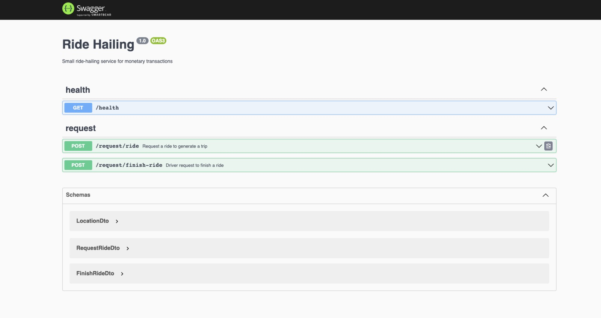
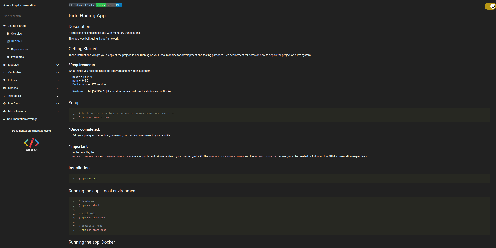

[](https://github.com/jacksonr20/ride-hailing-service-test/actions/workflows/ride-hailing-workflow-ci.yml)[](https://opensource.org/licenses/MIT)

# Ride Hailing App

## Description

A small ride-hailing service app with monetary transactions.

This app was built using: [Nest](https://github.com/nestjs/nest) framework

## Getting Started

These instructions will get you a copy of the project up and running on your local machine for development and testing purposes. See deployment for notes on how to deploy the project on a live system.

### \* Requirements

What things you need to install the software and how to install them.

- node >= 18.14.0
- npm >= 9.6.0
- [Docker](https://docs.docker.com/get-docker/) In latest LTE version

* [Postgres](https://www.postgresql.org/download/) == 14. [OPTIONAL] If you rather to use postgres locally instead of Docker.

## Setup

```bash
# In the project directory, clone and setup your environment variables:
$ cp .env.example .env
```

### \* Once completed:

- Add your postgres: name, host, password, port, ssl and username in your .env file.

### \*  Important

- In the .env file, the </br> `GATEWAY_SECRET_KEY` and `GATEWAY_PUBLIC_KEY` are your public and private key from your payment_roll API. The `GATEWAY_ACCEPTANCE_TOKEN` and the `GATEWAY_BASE_URL` as well, must be created by following the API documentation respectively.

### Note:

- The given `MAP_BOX` environment variables will expires in 3 days from now.

## Installation

```bash
$ npm install
```

## Running the app: Local environment

```bash
# development
$ npm run start

# watch mode
$ npm run start:dev

# production mode
$ npm run start:prod
```

## Running the app: Docker

```bash
# check if you have docker installed in your machine:
$ docker --version || docker -v

# The above should return the version of docker. Otherwise, check again requirements section

# Build and run the containers:
$ docker-compose up -d

# The comment above should create the following 3 containers:

* ride_hailing_app
* ride_hailing_database
* pgadmin
```

## Swagger



To access to this swagger, you must open in a new tab a url that will look like this: <br> `<your_server>:<your_port>/api/` or [open this link for localhost](http://localhost:3000/api/) if you have the 3000 port by default.

### \* IMPORTANT

- You must have create a `Rider` and a `Driver` in order to make the app work. Have in mind that his is required, therefore, it would not work.

* Please, check #Pending# section in this documentation below for more information of this requirement.

## Just in case you are using Docker [OPTIONAL]:

### To execute requests to the endpoints:

- example: [http://localhost/6543](http://localhost/6543)

### To establish a straight connection to postres:

- example: [http://localhost/5432](http://localhost/5432)

## Test

```bash
# unit tests
$ npm run test

# e2e tests
$ npm run test:e2e

# test coverage
$ npm run test:cov
```

## Compodoc



Execute the following command to get a detailed documentation of this project.

```bash
$ npm run compodoc
```

## Pending:

- Since the seeders is a work in progress, the only way to run successfully the app is by creating a `Rider` and a `Driver` in the Swagger hub.

* Please check #Swager# section above to have more info about how to create a `Rider` and a `Driver`.

## Support

Nest is an MIT-licensed open source project. It can grow thanks to the sponsors and support by the amazing backers. If you'd like to join them, please [read more here](https://docs.nestjs.com/support).

## Stay in touch

- Author - [Jackson Rodriguez](https://github.com/jacksonr20)
- Gmail - [jackson.rodriguezf@gmail.com](mailto:jackson.rodriguezf@gmail.com)

## License

Ride Hailing App is [MIT licensed](LICENSE).
